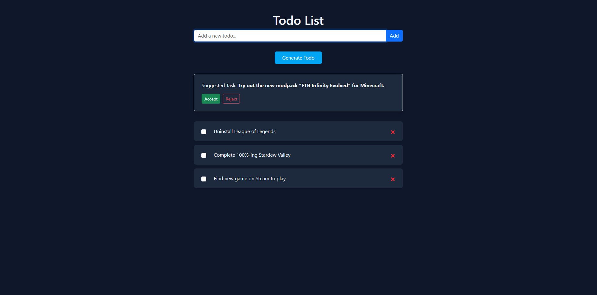

# AI Todo List Generator App

This is a full-stack AI-enhanced Todo app. It allows users to add, complete, and delete todos, as well as generate new ones using OpenAI's GPT model, streamed to user in real-time.



---

## Technologies Used

### Frontend

- **React** with **Vite** – fast, modern frontend tooling
- **Apollo Client** – GraphQL queries and mutations
- **Tailwind CSS** – utility-first styling
- **Bootstrap** – component styling
- **TypeScript** – optional type safety
- **Vite Environment Variables** – for API configuration

### Backend

- **FastAPI** – high-performance Python web framework
- **Strawberry GraphQL** – GraphQL API integration
- **SQLModel** – SQLAlchemy-based ORM with pydantic support
- **SQLite** – lightweight, local database
- **OpenAI API** – used to generate todos via streamed responses

### Dev Tools

- **Poetry** – Python dependency and environment management
- **Prettier** + **Ruff** – suggested for formatting and linting

---

## Running the App Locally

### 1. Setup Backend

```bash
cd backend
cp .env.example .env

# Install dependencies using Poetry
poetry install

# Run the backend locally
poetry run uvicorn app.main:app --reload
```

The backend will be available at \`http://localhost:8000\`

### 2. Setup Frontend

```bash
cd frontend
cp .env.example .env
npm install
npm run dev
```

The frontend will be available at \`http://localhost:5173\`

---

## Generate Todos with OpenAI

Make sure you have an OpenAI API key in your backend `.env` file:

```env
OPENAI_API_KEY=your-key-here
```

When you click “Generate Todo”, the app will send your existing todos to OpenAI and stream back a suggestion.

---

## Folder Structure

```
backend/
  ├── app/
  │   ├── api/
  │   ├── core/
  │   ├── db/
  │   └── main.py
  └── pyproject.toml

frontend/
  ├── src/
  │   ├── components/
  │   ├── graphql/
  │   ├── lib/
  │   └── App.tsx
  └── index.html
```

---

## Testing

This version is designed for manual testing and demo functionality. All todos are stored in SQLite (\`todos.db\`) and regenerated on startup if missing.
